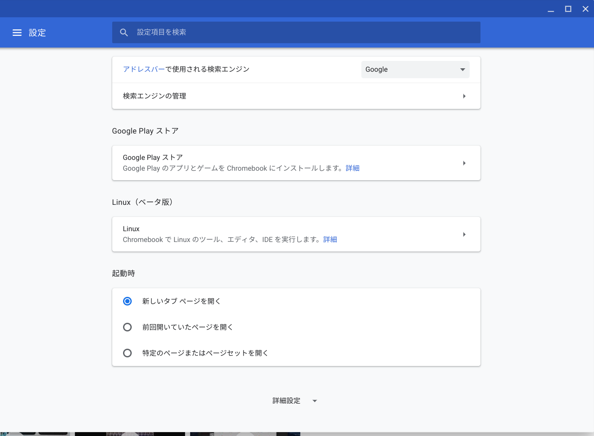

ついにChromebookでLinuxがつかえるようになりました。
2018年5月の「Google I/O」にて発表があったものが8月にBeta版として利用可能になりました。
なので軽くレビューを書こうと思います。

## Linux機能の有効化

設定のLinux（ベータ版）のところにある `有効化`ボタンをクリックすると有効化されます。
※ 画像は有効化後の設定画面です。



しばらく放置しておくとターミナルアプリが追加されるのでそれを実行するとBashが起動してLinuxが操作できます。

## System

```sh
> uname -a
Linux penguin 4.14.74-07776-gac52e5f750c8 #1 SMP PREEMPT Thu Dec 6 17:36:39 PST 2018x86_64 GNU/Linux
> cat /etc/os-release
PRETTY_NAME="Debian GNU/Linux 9 (stretch)"
NAME="Debian GNU/Linux"
VERSION_ID="9"
VERSION="9 (stretch)"
ID=debian
HOME_URL="https://www.debian.org/"
SUPPORT_URL="https://www.debian.org/support"
BUG_REPORT_URL="https://bugs.debian.org/"
```

起動するのは普通のDebianなので 、`apt-get` で必要なものを入れればいいです。

## メリット

`docker` が使えるようになったのが個人的に一番嬉しいポイントです。
感覚的には Windowsの`WSL(Windows Subsystem Linux)` に近いですが、あちらは `docker` を使うのに細々とした設定が必要なのでその点ではこちらの方が優秀。

## デメリット

以前の記事に書いたように、やはり文字入力周りはおぼつかない。
あとこれはChromebook自体の問題なんですが、開発環境として使えるようになるとやはりパワー不足感が否めないです。
開発環境として使えるようになるとやはりパワー不足感が否めないです。

Pythonのビルドと同時平行だったので参考ですが、Neovimのビルドに20分ほどかかりました…

## 感想

着々と使い勝手が良くなっているという印象。
更新頻度も高いですし、家で使うサブ機としては本当に優秀ですね。
価格も安いですし庶民の味方です。
メインマシンを買うだけの余裕が出来るまでしばらくは活躍してくれそうです。
